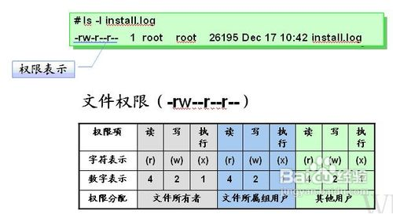

<!--Chapter3.md-->

# 第三章 深入了解Linux

## 3.1 用户管理系统

Linux 是一个可以实现多用户登陆的操作系统，多用户可以同时登陆同一 台主机，共享主机的一些资源，不同的用户也分别有自己的用户空间， 可用于存放各自的文件。

虽然不同用户的文件是放在同一个物理磁盘上的甚至同一个逻辑分区或 者目录里，但是由于 Linux 的用户管理和文件权限机制，不同用户不可 以轻易地查看、修改彼此的文件。

那就先看看我们是谁呗。

### 查看用户

查看当前用户有多种方式可以实现，我们试试下面三种命令：
* $ who am i:只列出用户名 
* $ who mom likes/who am i:列出用户名，所使用终端的编号和开 启时间； 
* $ finger:列出当前用户的详细信息，需使用apt-get提前安装； 实 例：
```
$ who mom likes 
fanghr ttys006  Sat 8 23:58 
$ who am i 
fanghr ttys006  Sat 8 23:58 
# pts/0 中 pts(mac ttys) 表示伪终端,pts/0(ttys006) 后面那个数字就表示打开的伪终端序号 
$ sudo apt-get finger
$ finger # 会列出当前用户的信息 
Login      Name        Tty      Idle  Login Time   Office     Office Phone 
fanghr   fanghr  pts/0         Sat  4 23:04 
(192.168.1.104)
```

### 老大用户root

一般通过上面的操作会发现我们当前登录的用户并非root,在Linux中，老 大root账户拥有整个系统至高无上的权利，它可以操作系统中所有的对 象。

在某些发行版中，这个用户并不显式存在，不过如果其它的用户具有使 用sudo的权利（后文会叙述如何获取），通过sudo 命令也可以达到用 root账号操作的效果。创建用户就是一个需要sudo权限的命令。

#### 创建用户adduser

此命令的使用可参看以下实例：

```
fanghr@ADMIN:/mnt/c/Windows/System32$ sudo adduser student 
[sudo] password for fanghr: 
Adding user `student' ... 
Adding new group `student' (1001) ... 
Adding new user `student' (1001) with group `student' ... 
Creating home directory `/home/student' ... 
Copying files from `/etc/skel' ... 
Enter new UNIX password: 
Retype new UNIX password:
No password supplied 
Enter new UNIX password: 
Retype new UNIX password: 
passwd: password updated successfully 
Changing the user information for student Enter the new value, or press 
ENTER for the default
    Full Name []: 
    Room Number []: 
    Work Phone []:   
    Home Phone []:   
    Other []: 
Is the information correct? [Y/n] 
# finger 用户管理用户 
fanghr@Ubuntu:~$ finger student 
Login: student                    Name: Udacity Linux Student 
Directory: /home/student                Shell: /bin/bash 
Never logged in. 
No mail. 
No Plan.
```

说完了如何添加用户，再说说如何切换用户。

#### 切换用户相关命令：

su <user>:切换到用户user,执行时需要输入目标用户的密码； su <user>:切换用户，同时环境变量也会跟着改变成目标用户的环境变量。 
su -l lilei:切换登录用户;

有时候我们也会看到添加用户使用的命令是useradd,而非adduser下面说说二者的区别： sudo adduser lilei:新建一个叫做lilei的用户，添加用户到系统，同时也会默认为新用户创建 home目录： sudo useradd lilei:只创建用户，创建完了需要用 passwd lilei 去设置新用户的密码;

### 用户组，给用户添加组织

在 Linux 里面每个用户都有一个归属（用户组），用户组简单地理解就是一组用户的集合，它们共享一些资源和权限，同时拥有私有资源。

#### 查看用户属于那些组（groups）：

使用示例：

```
~ groups fanghr
fanghr adm cdrom sudo dip plugdev docker
```

关于用户组我们需要注意：
* 每次新建用户如果不指定用户组的话，默认会自动创建一个与用户名相同的用户组； 
* 默认情况下在 sudo 用户组里的可以使用 sudo 命令获得 root 权限。 
* 使用cat /etc/group | sort命令查看某组包含那些成员:/etc/group文件中分行显示了用户组（Group）、用户组口令、GID 及该用户组所包含的用户（User），格式如下：

```
group_name:password:GID:user_list 
group:*:16: 
interactusers:*:51: 
kmem:*:2:root 
localaccounts:*:61:
# *表示密码不可见 
mail:*:6:_teamsserver
```

#### 为用户添加组织

不同的组对不同的文件可能具有不同的操作权限，比如说通过上述命令新建的用户默认是没有使用sudo的权限的，我们可以使用usermod命令把它加入sudo组用以具备相应的权限。 方法如下：

```
$ sudo usermod -G sudo student 
$ groups lilei 
# lilei:lilei sudo
```

### 删除用户的方法
删除用户也是一个需要管理员权限的命令，使用方法如下：
sudo deluser student --remove-home：删除用户及用户相关文件；
直接的deluser会删除该用户，但是不会删除用户相关文件；

## 3.2文件权限管理
使用Linux的过程中，查看修改文件是我们常做的事情之一。但是正如前文所说，文件是有所有权概念的，对同一个文件并非所有用户都对其有一样的权限。

前面我们提到使用ls命令可以查看文件，ls后还可以带各种参数以实现不同的查看效果，具体如下：

* ls -l:查看文件及其权限; 
* ls -A：显示隐藏文件（包括以.开头的文件）；(a->all) 
* ls -Al:显示隐藏文件及其权限； 
* ls -dl<查看一文件的完整属性>:(d->detail)
* ls -AsSh:显示所有文件大小，并以普通人类能看懂的方式呈现(小 s为显示文件大小，大 S 为按文件大小排序);

示例如下(注：命令行中的~是我所操作的当前目录的名称(home))：
```
fanghr@ADMIN:~$ ls -l 
total 17204 
drwxrwxrwx 2 fanghr fanghr        0 Jul  9 23:20 aalib-1.4p5 
-rw-rw-rw- 1 fanghr fanghr    16718 Aug 17  2013 aalib_1.4p5-41.debian.tar.gz 
-rw-rw-rw- 1 fanghr fanghr     2078 Aug 17  2013 aalib_1.4p5-41.dsc 
-rw-rw-rw- 1 fanghr fanghr   391028 May 12  2004 aalib_1.4p5.orig.tar.gz 
-rwxrwxrwx 1 fanghr fanghr     8573 Jul 18 18:06 a.out 
drwxrwxrwx 2 fanghr fanghr        0 Jul 19 14:16 esp-open-sdk 
-rw-rw-rw- 1 fanghr fanghr    80285 Jul 19 14:05 esp-open-sdk.git 
-rw-rw-rw- 1 fanghr fanghr    12965 Dec 13  2016 install.sh 
-rw-rw-rw- 1 fanghr fanghr       42 Jul 22 10:31 maps 
-rw-rw-rw- 1 fanghr fanghr     9384 Jul 22 10:32 maps?v=1.3 
-rw-rw-rw- 1 fanghr fanghr     9384 Jul 22 10:51 maps?v=1.3.1
drwxrwxrwx 2 fanghr fanghr        0 Jul 16 15:23 markdown2html 
drwxrwxr-x 2 fanghr fanghr        0 Jul 10 14:11 node_modules 
drwxrwxr-x 2 fanghr fanghr        0 Jun 15 19:44 node-v8.1.2-linux-x64
-rwxrwxrwx 1 fanghr fanghr 17047292 Jul 10 14:23 node-v8.1.2-linux-x64.tar.gz 
-rw-rw-rw- 1 fanghr fanghr        0 Jul 16 15:32 out.html 
-rw-rw-rw- 1 fanghr fanghr      102 Jul 18 18:06 test.cpp 
-rwxrwxrwx 1 fanghr fanghr       58 Jul 18 18:16 test.sh 
drwxrwxrwx 2 fanghr fanghr        0 Jul  7 21:42 tetris 
drwxrwxrwx 2 fanghr fanghr        0 Jul 10 14:11 tmp 
# 文件类型和权限 链接数 所有者 用户所在组 大小 最后修改 时间 文件名称
```
上面的代码中，最让人疑惑的可能就是文件类型和权限这一项了，我们 来逐一解释。

### 文件类型

说到文件，不得不提文件类型，Linux中的文件不同于Windows中的文 件，在Linux 里面一切皆文件，主要文件类型有以下几种：

* 普通文件：一般是用一些相关的应用程序创建的（如图像工具、 文档工具、归档工具... 或 cp工具等),这类文件的删除方式是用rm 命令,而创建使用touch命令,用符号-表示； 
* 目录：目录在Linux是一个比较特殊的文件，用字符d表示，删除用rm 或rmdir命令； 
* 块设备文件：存在于/dev目录下，如硬盘，光驱等设备，用字符d 表示; 
* 设备文件：（ /dev 目录下有各种设备文件，大都跟具体的硬件设 备相关），如猫的串口设备，用字符c表示； 
* socket文件;用字符s表示，比如启动MySQL服务器时，产生的 mysql.sock的文件; 
* pipe 管道文件：可以实现两个程序（可以从不同机器上telnet）实 时交互，用字符p表示； 
* 链接文件:软链接等同于 Windows 上的快捷方式；用字符l表示； (软硬链接文件的共同点和区别：无论是修改软链接，硬链接生成 的文件还是直接修改源文件，相应的文件都会改变，但是如果删 除了源文件，硬链接生成的文件依旧存在而软链接生成的文件就 不再有效了。)

### 文件权限

上面的代码示例中，另一个比较让人疑惑的是drwxr-xr-x这样的语句，这 段语句表明了文件的权限。Linux中文件权限主要由以下几种：
* 读权限(r)：可以使用 cat 之类的命令来读取某个文件的内容; 
* 写权限(w)，表示你可以编辑和修改某个文件；
* 执行权限(x)，通常指可以运行的二进制程序文件或者脚本文件 (Linux上不是通过文件后缀名来区分文件的类型);

所有者权限，所属用户组权限，是指你所在的用户组中的所有其它用户 对于该文件的权限。 一个目录同时具有读权限和执行权限才可以打开并 查看内部文件，而一个目录要有写权限才允许在其中创建其它文件，这 是因为目录文件实际保存着该目录里面的文件的列表等信息。 可用下图 加强对文件权限的理解：


#### 修改文件权限的办法

从上图中可以看出，每个文件有三组权限（拥有者，所属用户组，其他 用户，这个顺序是一定的），修改权限的命令是chmod,修改文件权限的 方法有两种,所示：
```
# 用数字的形式表示，数字的来源及计算方法见下文,数字的意 义见下文
$ chmod 700 node # 让用户对node件具备读写权限，所在组 和其它用户都没有读写权限
# 用字母的形式表示，g、o 还有 u 分别表示 group、 others 和 user，+ 和 - 分别表示增加和去掉相应的权限
$ chmod go-rw node # 让用户所属用户组及其它用户这个文 件不再有读写权限
```

文件权限的数字计算方式：

* r对应4，
* w对应2，
* x对应1，
* -对应0，

权限的数字代码即为上述几个值相加，如rw-=4+2+0=6。

####  更改文件所有者chown

上面描述文件权限时，都是以自己，所在组，其它三个级别来描述的， 那如果你登录的当前账户不是某个文件的所有者，你又不想让这个文件 对所有用户开发你想用到的权限，该怎么办呢？ 还记得前面我们说过老 大root用户对所有的文件具有绝对的支配权，我们可以利用这个账号把 一个文件过继给另外一个用户（更改文件的所有者）以方便该用户对该 文件的操作，使用方法如下：
```
# sudo 表示已root的权限执行，下面语句的意思是 把/etc/apt文件夹下面的sources.list的所有权转让给用户 fanghr 
$ sudo chown fanghr /etc/apt/sources.list 
$ sudo chmod 700 /etc/apt/sources.list
```

## 3.3对文件的基本操作

现在我们有能力获得对某文件的操作能力了，接下来看看Linux下对文件 进行简单操作的命令。

1. 创建文件touch:

主要作用是来更改已有文件的时间戳的（比如，最近访问时间，最近修 改时间）; 在不加任何参数的情况下，只指定一个文件名，则可以创建一 个指定文件名的空白普通文件（不会覆盖已有同名文件）

2. 创建文件夹mkdir:

新建空目录$ mkdir mydir

新建多级目录$ mkdir -p father/son/grandson

3. 复制cp:

$ cp test father/son/grandson:复制test文件到father/son/grandson；

$ cp -r father family:递归复制目录

4. 移动mv：

$ mv file1 Documents:移动文件files到Documents目录

$ mv file1 myfile:将文件“ file1 ”重命名为“ myfile ” 5.删除rm:

$ rm test:删除test

$ rm -f test:删除只读文件，强制删除

$ rm -r family:删除目录（递归删除其中的子文件）

5. 批量重命名rename,需要用到正则表达式：

代码示例：

```
# 使用通配符批量创建 5 个文件: $ touch file{1..5}.txt
# 批量将这 5 个后缀为 .txt 的文本文件重命名为以 .c 为 后缀的文件: $ rename 's/\.txt/\.c/' *.txt
# 批量将这 5 个文件，文件名改为大写: $ rename 'y/a-z/A-Z/' *.c
```
6. 查看文件cat:打印文件内容到标准输出（终端）(正序);

cat -n passwd:显示行号,此外还有以下命令

tac:打印文件内容到标准输出（终端）(逆序)；

>标准输入输出：当我们执行一个shell命令行时通常会自动打开三 个标准文件，即标准输入文件（stdin），默认对应终端的键盘、 标准输出文件（stdout）和标准错误输出文件（stderr），后两个 文件都对应被重定向到终端的屏幕，以便我们能直接看到输出内 容。进程将从标准输入文件中得到输入数据，将正常输出数据输 出到标准输出文件，而将错误信息送到标准错误文件中。

对cat,tac参数的说明如下：

-b: 指定添加行号的方式，主要有两种：

-b a:表示无论是否为空行，同样列出行号("cat -n"就是这种方式)

-b t:只列出非空行的编号并列出（默认为这种方式）

-n : 设置行号的样式，主要有三种：

-n ln:在行号字段最左端显示

-n rn:在行号字段最右边显示，且不加 0

-n rz:在行号字段最右边显示，且加 0

-w : 行号字段占用的位数(默认为 6 位)

7. more:比较简单，只能向一个方向滚动,查看文件：打开后默认只显示一 屏内容，终端底部显示当前阅读的进度。可以使用 Enter 键向下滚动一行，使用 Space 键向下滚动一屏，按下 h 显示帮助，q 退出。
8. less:less 基于 more 和 vi查看文件，使用基本和 more 一致
9. head:查看文件的头几行（默认10行）
10. tail:查看文件的尾几行（默认10行）

$ tail -n 1 /etc/passwd查看固定行数

11. .file:查看文件类型$ file /bin/ls

## 3.4Linux 的目录结构

前面多次提到了类似/dev这样的目录,也提到了目录文件d,不知道你对目 录有没有也产生好奇，Linux的目录也是Linux系统中比较重要的一块，不 过首先我们得区分Linux的目录和Window的目录的较大的区别：

不同之一体现在目录与存储介质（磁盘，内存，DVD等）的关系上， Windows一直是以存储介质为主的，主要以盘符（C盘，D盘...）及分区 来实现文件管理，然后之下才是目录，目录就显得不是那么重要，除系 统文件之外的用户文件放在任何地方任何目录也是没有多大关系。

然而 UNIX/Linux 恰好相反，UNIX 是以目录为主的，Linux 也继承了这一 优良特性。 Linux 以树形目录结构的形式来构建整个系统，可以理解为 树形目录是一个用户可操作系统的骨架。虽然本质上无论是目录结构还 是操作系统内核都是存储在磁盘上的，但从逻辑上来说 Linux 的磁盘 是“挂在”（挂载在）目录上的，每一个目录不仅能使用本地磁盘分区的文 件系统，也可以使用网络上的文件系统。

简言之，Windows的目录挂载在磁盘下，而Linux磁盘挂载在目录下，使 用Mac的童鞋们，看了这段话是不是突然明白了为什么Mac上安装第三方 软件时，会出现盘符（老厉害了）。

初接触Linux时，我们很容易被其看似复杂的文件系统弄得晕头转向，其 实在掌握了一定的规律后，Linux的目录结构是比Window简单的（你现 在能说清windows系统盘各文件夹的作用不），Linux的大部分目录结构 是依据FHS标准（英文：Filesystem Hierarchy Standard 中文：文件系统 层次结构标准）规定好的，多数Linux版本采用这种文件组织形式，FHS 定义了系统中每个区域的用途、所需要的最小构成的文件和目录同时还 给出了例外处理与矛盾处理。

FHS包含两层规范：
* 第一层是， / （根目录，rootfs）下面的各个目录应该要放什么文 件数据，例如 /etc 应该放置设置文件，/bin 与 /sbin 则应该放置可 执行文件等等。
* 第二层则是针对 /usr及/var这两个目录的子目录来定义。例 如/var/log放置系统登录文件，/usr/share 放置共享数据等等。

这里有个有用的命令:tree(需要先安装)，可以查看某个目录的子目录的结 构，这个命令还可以限制目录的展示层级，通过man tree你可以获知如 何进行具体的操作。

FHS 是根据以往无数 Linux用户和开发者的经验总结出来的，并且会维持 更新，网上有很多结束FHS的文章，如果感兴趣可以搜索看看emmm。

我们回顾一下关于目录的一些常用相关命令/代码：

* .:表示本目录 
* ..：表示上一级目录 
* cd:切换目录，后面可以是相对目录，也可以是绝对目录，如$ cd /usr/local/bin会切换到/usr/local/bin目录，$ cd会切换到家(home) 目录下 
* pwd:查看当前所在目录
* du:查看目录的容量,配合以下参数可以实现更多效果。 参数： -d: 指定查看目录的深度
```
# 只查看1级目录的信息 
$ du -h -d 0 ~ 
# 查看2级 
$ du -h -d 1 ~
```

du -h :同--human-readable 以K，M，G为单位，提高信息的可读性。 du -a:同--all 显示目录中所有文件的大小。 du -s :同--summarize 仅显示 总计，只列出最后加总的值。

### Linux的磁盘管理

在Linux下磁盘是挂载在目录下的，前文大致聊了目录，接下来我们简单 说说磁盘管理，前面刚刚说完如何查看目录容量，我们先看下如何查看 磁盘的容量。

1. 查看磁盘容量df:使用df命令可以查看磁盘的容量 使用方法可见下例：

```
fanghr@ADMIN:~$ df Filesystem     1K-blocks     Used Available Use% Mounted on 
rootfs         103870280 95489556   8380724  92% / 
tmpfs          103870280 95489556   8380724  92% /run 
none           103870280 95489556   8380724  92% /run/lock 
none           103870280 95489556   8380724  92% /run/shm
none           103870280 95489556   8380724  92% /run/user

```

以更友善的方式展示:
```
$ df -h
```
2. 创建虚拟磁盘dd:

dd命令用于转换和复制文件，不过它的复制不同于cp。之前提到过关于 Linux 的很重要的一点，一切即文件，在Linux上，硬件的设备驱动（如 硬盘）和特殊设备文件（如/dev/zero和/dev/random）都像普通文件一 样，只要在各自的驱动程序中实现了对应的功能，dd也可以读取自和/或 写入到这些文件。这样，dd也可以用在备份硬件的引导扇区、获取一定 数量的随机数据或者空数据等任务中。dd程序也可以在复制时处理数 据，例如转换字节序、或在 ASCII 与 EBCDIC 编码间互换。

语句格式:选项=值

dd默认从标准输入中读取，并写入到标准输出中,但输入输出也可以用选 项if（input file，输入文件）和of（output file，输出文件）改变。

dd复制的基本使用方法如下： $ dd if=/dev/stdin of=/dev/stdout bs=10 count=1

将输出的英文字符转换为大写再写入文件: $ dd if=/dev/stdin of=test bs=10 count=1 conv=ucase

bs（block size）用于指定块大小（缺省单位为Byte，也可为其指定 如'K'，'M'，'G'等单位），count用于指定块数量。超过bs的多余输入将被截取并保留在标准输入。

使用dd命令创建虚拟镜像文件: Step 1:从/dev/zero设备创建一个容量为 256M 的空文件virtual.img：

```
$ dd if=/dev/zero of=virtual.img bs=1M count=256 
$ du -h virtual.img

```

Step 2:使用mkfs命令格式化磁盘 输入 sudo mkfs 然后按下Tab键，你可以 看到很多个以mkfs为前缀的命令,代表不同的文件系统格式,如：

```
# 格式化virtual.img为ext4格式 
$ sudo mkfs.ext4 virtual.img
```

3. 使用 mount 命令挂载磁盘到目录树
>用户在 Linux/UNIX 的机器上打开一个文件以前，包含该文件的文件系统必须先进行挂载的动作，此时用户要对该文件系统执行mount的指令以进行挂载。Linux/UNIX文件系统可以对应一个文件而不一定要是硬件设备，所以可以挂载一个包含文件系统的文件到目录树。

具体使用方法如下：

查看下主机已经挂载的文件系统，每一行代表一个设备或虚拟设备格式 [设备名]on[挂载点]：

```
fanghr@ADMIN:~$ mount 
rootfs on / type rootfs (rw,relatime)
sysfs on /sys type sysfs (rw,nosuid,nodev,noexec,relatime) 
proc on /proc type proc (rw,nosuid,nodev,noexec,relatime) 
devpts on /dev/pts type devpts (rw,nosuid,noexec,relatime,gid=5,mode=620,ptmxmod e=000) 
tmpfs on /run type tmpfs (rw,nosuid,noexec,relatime,size=204320k,mode=755) 
none on /run/lock type tmpfs (rw,nosuid,nodev,noexec,relatime,size=5120k) 
none on /run/shm type tmpfs (rw,nosuid,nodev,relatime) 
none on /run/user type tmpfs (rw,nosuid,nodev,noexec,relatime,size=102400k,mod e=755)
```

挂载文件到目录树mount [-o [操作选项]] [-t 文件系统类型] [-w|--rw|--ro] [文件系统源] [挂载点]:

```
# 类型可省略，很多时候会自动识别 
$ mount -o loop -t ext4 virtual.img /mnt 
# 以只读方式挂载 
$ mount -o loop --ro virtual.img /mnt
```

4. 使用fdisk 为磁盘分区 磁盘分区大家肯定也很熟悉，Linux下对磁盘分区的方法也很简单，示例如下

```
# 查看硬盘分区表信息 
$ sudo fdisk -l
# 进入磁盘分区模式 
$ sudo fdisk virtual.img
```

到这里，（吹水操作+1）我们初步初步了解了Linux的核心系统，接下来 我们对Linux下的一些常用操作进行叙述。

## 3.5Linux的常用操作

很多人装完系统后第一件事就是装软件，应用部分我们也从软件的安装 说起，还是以Ubuntu为例介绍软件的安装和卸载方法。

### 软件的安装与卸载

Linux上软件的安装有四种形式：
* 在线安装（apt/脚本） 
* 从磁盘安装deb/snap/rpm安装包 
* 从二进制软件包（bin）直接安装 
* 从源代码安装

### 在线安装

在线安装命令很简洁，我们先看使用方式，然后叙述每一步的意义： \$sudo apt-get install cowsay 如果你在安装一个软件之后，无法立即使用Tab键补全这可命令,使用下述命令刷新(zsh):$ source ~/.zshrc

那么安装的过程究竟发生了什么：

Step 1:apt的守护进程收到请求并核对权限；

Step 2:apt在本地的一个数据库(cache)中搜索关于 cowsay 软件的相关信息；

Step 3:根据这些信息在相关的服务器上下载软件安装。安装某个软件时，如果该软件有其它依赖程序，系统会为我们自动安装所以来的程序；

如果本地的数据库不够新，可能就会发生搜索不到的情况，这时候需要 我们更新本地的数据库，使用命令sudo apt-get update可执行更新；

软件源镜像服务器可能会有多个，有时候某些特定的软件需要我们添加 特定的源； 镜像源的配置文件位于/etc/apt/sources.list中。

#### 对apt-get描述 

很可能apt-get会是很长一段时间内，你使用的最多的命令，我们先对其进行详细的描述： 作用：用于处理 apt包的公用程序集，我们可以用它来在线安装、卸载和升级软件包

apt-get命令后可以接不同的工具实现不同的效果，描述如下：

工具  说明 
install 其后加上软件包名，用于安装一个软件包
update
从软件源镜像服务器上下载/更新用于更新本地软件源 的软件包列表
upgrade
升级本地可更新的全部软件包，但存在依赖问题时将 不会升级，通常会在更新之前执行一次update
distupgrade
解决依赖关系并升级(存在一定危险性)
remove
移除已安装的软件包，包括与被移除软件包有依赖关 系的软件包，但不包含软件包的配置文件

|工具|说明|
|-|-|
|install |其后加上软件包名，用于安装一个软件包|
|update|从软件源镜像服务器上下载/更新用于更新本地软件源 的软件包列表
|upgrade|升级本地可更新的全部软件包，但存在依赖问题时将 不会升级，通常会在更新之前执行一次update
|distupgrade|解决依赖关系并升级(存在一定危险性)
|remove|移除已安装的软件包，包括与被移除软件包有依赖关系的软件包，但不包含软件包的配置文件
|autoremove |移除之前被其他软件包依赖，但现在不再被使用的软件包
|purge|与remove相同，但会完全移除软件包，包含其配置文件
|clean|移除下载到本地的已经安装的软件包，默认保存在/var/cache/apt/archives/
|autoclean |移除已安装的软件的旧版本软件包

apt-get后还可以更一些常见的参数，对这些参数的描述如下：

-y :自动回应是否安装软件包的选项，在一些自动化安装脚本中使用这个 参数将十分有用

-s: 模拟安装

-q: 静默安装方式，指定多个q或者-q=#,#表示数字，用于设定静默级 别，这在你不想要在安装 软件包时屏幕输出过多时很有用

-f: 修复损坏的依赖关系

-d: 只下载不安装

--reinstall: 重新安装已经安装但可能存在问题的软件包

--install-suggests: 同时安装APT给出的建议安装的软件包

实例

```
# 重装 
$ sudo apt-get --reinstall install w3m 
# 更新软件源
$ sudo apt-get update 
# 升级没有依赖问题的软件包 
$ sudo apt-get upgrade 
# 升级并解决依赖关系 
$ sudo apt-get dist-upgrade 
# 卸载 $ sudo apt-get remove w3m

# 不保留配置文件的移除 
$ sudo apt-get purge w3m 
# 或者 sudo apt-get --purge remove 
# 移除不再需要的被依赖的软件包
$ sudo apt-get autoremove
```

#### 使用apt-cache 命令实现软件搜索

sudo apt-cache search softname1 softname2 softname3…… apt-cache命令则是针对本地数据进行相关操作的工具，search 顾名思义在本地的数据库中寻找有关 softname1 softname2 …… 相关软件的信息

使用dpkg从本地磁盘安装deb软件包

有时候我们也需要下载一些安装包安装，比如你想在Ubuntu下使用webstorm，就可以在其官网上下载响应的deb软件包，使用dpkg命令来安装。

dpkg的常见参数如下：
-i 安装指定deb包

-R 后面加上目录名，用于安装该目录下的所有deb安装包

-r remove，移除某个已安装的软件包

-I 显示deb包文件的信息

-s 显示已安装软件的信息

-S 搜索已安装的软件包

-L 显示已安装软件包的目录信息

使用实例:
```
$ cp /var/cache/apt/archives/emacs24_24.3+14ubuntu1_amd64.deb ~ 
# 安装之前参看deb包的信息 
$ sudo dpkg -I emacs24_24.3+1-4ubuntu1_amd64.deb 
# dpkg并不能为你解决依赖关系 
$ sudo dpkg -i emacs24_24.3+1-4ubuntu1_amd64.deb 
# 修复依赖关系的安装 
$ sudo apt-get -f install 
# 查看已安装软件包的安装目录 
$ sudo dpkg -L emacs
```
### 从二进制安装

二进制包的安装比较简单，我们需要做的只是将从网络上下载的二进制 包解压后放到合适的目录，然后将包含可执行的主程序文件的目录添加 进PATH环境变量即可，如果你不知道该放到什么位置，请重新复习关于 Linux 目录结构的内容。

说到了环境变量(environment variable)，接下来我们仔细聊聊shell下的变 量，并掌握添加环境变量的方法。

## 3.6Linux变量

或许你也有过这样的经历，想通过命令行启动某些操作，比如说使用 VSCode时希望通过在命令行中通过code ./project命令打开相应的文件夹(ps:推荐vscode，一个很好用的带git的编辑器）。

各编程语言中都有变量的概念，Shell中的变量也基本如此，变量有如下特点

* 有不同类型（但不用专门指定类型名） 
* 可以参与运算 
* 有作用域限定。

我们看看在bash中添加变量的方法：

```
#使用 declare 命令创建一个变量名为 tmp 的变量 
$ declare tmp:

# 使用 = 号赋值运算符，将变量 tmp 赋值为 God 
$ tmp=God

# 读取变量的值：使用 echo 命令和 $ 符号（$ 符号用于表 示引用一个变量的值） 
$ echo $tmp 
# 将输出God
```

### Shell中的变量类型

1. 自定义变量：当前 Shell 进程私有用户自定义变量，如上面我们创建的 tmp 变量，只在当前 Shell 中有效。 相关命令：

set:显示当前 Shell所有变量，包括其内建环境变量（与Shell外观等相 关），用户自定义变量及导出的环境变量。

2. Shell 本身内建的变量

相关命令:

env:显示与当前用户相关的环境变量，还可以让命令在指定环境中运行。

3. 从自定义变量导出的环境变量。

相关命令：

export ：显示从 Shell中导出成环境变量的变量，也能通过它将自定义变量导出为环境变量。

export temp:导出变量temp为环境变量

* 通常我们习惯将环境变量名设置为大写

>在所有的 UNIX 和类UNIX系统中，每个进程都有其各自的环境变量设置，且默认情况下，当一个进程被创建时，处理创建过程中明确指定的话，它将继承其父进程的绝大部分环境设置。Shell 程序也作为一个进程运行在操作系统之上，而我们在Shell中运行的大部分命令都将以 Shell 的子进程的方式运行。

环境变量，可以简单地理解成如果某变量在当前进程的子进程有效则为 环境变量，否则不是。(在Shell中输入zsh或者bash其实就是创建了一个子 shell)。

我们也可以安装生存周期划分Shell变量：
* 永久的：需要修改配置文件，变量永久生效； 
* 临时的：使用 export 命令行声明即可，变量在关闭 shell 时失效。

永久变量涉及到两个重要文件 /etc/bashrc（有的 Linux 没有这个文件） 和 /etc/profile ，它们分别存放的是 shell 变量和环境变量。

~/.profile（不是/etc/profile） 只对当前用户永久生效。而写在/etc/profile 里面的是对所有用户永久生效，所以如果想要添加一个永久生效的环境变量，只需要打开 /etc/profile，在最后加上你想添加的环境变量就好啦。

### 添加命令到环境变量

添加命令到环境变量几乎是每个使用Linux系统的人都会进行的操作：它实现了在 Shell 中输入一个命令，能通过环境变量 PATH 来进行搜索并执行命令，PATH 里面就保存了 Shell 中执行的命令的搜索路径。

添加自定义路径到"PATH"环境变量的具体方法如下：

一次性的：
```
# 这里一定要使用绝对路径 
$ PATH=$PATH:/home/fanghr/mybin 
# 给 PATH 环境变量追加了一个路径，它也只是在当前 Shell 有效，我一旦退出终端，再打开就会发现又失效了。
```

通过上述设置，就可以执行mybin目录下的所有命令了。

永久的： 想要永久的添加这类环境变量可以用接下来额方法，每个用户 的 home 目录中有一个 Shell 每次启动时会默认执行一个配置脚本，以初 始化环境，包括添加一些用户自定义环境变量等等。zsh 的配置文件是 .zshrc，相应 Bash 的配置文件为 .bashrc 。它们在 etc 下还都有一个或多 个全局的配置文件，不过我们一般只修改用户目录下的配置文件。
```
# 可以简单地使用下面命令直接添加内容到 .zshrc 中 
$ echo "PATH=$PATH:/home/fanghr/mybin" >> .zshrc
```

上述命令中 >> 表示将标准输出以追加的方式重定向到一个文件中。当 然，你用vim等编辑器直接打开对应文件也是可以实现类似的操作的。

### 修改和删除已有的变量

有如下几种方式：

* ${变量名#匹配字串}: 从头向后开始匹配，删除符合匹配字串的最 短数据 
* ${变量名##匹配字串}: 从头向后开始匹配，删除符合匹配字串的最 长数据 
* ${变量名%匹配字串}: 从尾向前开始匹配，删除符合匹配字串的最 短数据 
* ${变量名%%匹配字串}: 从尾向前开始匹配，删除符合匹配字串的 最长数据
* ${变量名/旧的字串/新的字串}:将符合旧字串的第一个字串替换为 新的字串 
* ${变量名//旧的字串/新的字串}: 将符合旧字串的全部字串替换为新 的字串

删除变量

```
# 删除变量temp 
$ unset temp
```
让环境变量立即生效： 有时候修改了环境变量并未马上生效可用下面这种方法使其马上生效：
```
# 在修改了.zshrc文件后 
$ source .zshrc 
# source有一个别名叫做.因此可以用下面的方法使得理解生效 （第一个点后面有一个空格，且路径需要为绝对路径或者相对路 径） 
$ . ./.zshrc
```

## 3.7文件的打包和压缩

文件的打包和压缩是另一种我们可能会常做的操作，比如说你想在服务器上部署一个wiki系统，下载了dokuwiki的压缩文件夹，这时候就需要解压啦。

常见压缩格式:
* *.zip zip程序打包压缩的文件 
* *.rar rar程序压缩的文件 
* *.7z 7zip程序压缩的文件 
* *.tar tar程序打包，未压缩的文件
* *.gz gzip程序（GNU zip）压缩的文件 
* *.xz xz程序压缩的文件 
* *.bz2 bzip2 程序压缩的文件 
* *.tar .gz tar打包，gzip 程序压缩的文件 
* *.tar .xz tar打包，xz 程序压缩的文件 
* *.tar .bz2 tar打包bzip2 程序压缩的文件

1. 使用zip压缩打包程序
```
$ zip -r -q -o fanghr.zip /home/fanghr 
# 查看文件大小 
$ du -h fanghr.zip 
$ file fanghr.zip 
# 设置不同压缩等级 
$ zip -r -9 -q -o fanghr_9.zip /home/fanghr -x ~/*.zip 
$ zip -r -1 -q -o fanghr_1.zip /home/fanghr -x ~/*.zip 
$ du -h -d 0 *.zip ~ | sort 
# 创建加密 
$ zip -r -e -o fanghr_encryption.zip /home/fanghr 
# 解决windows和linux对换行的不同处理问题 
$ zip -r -l -o fanghr.zip /home/fanghr
```

参数说明：

-r:表示递归打包包含子目录的全部内容

-q:表示为安静模式，即不向屏幕输出信息

-o:表示输出文件，需在其后紧跟打包输出文件名

-[1-9]:设置压缩等级，1 表示最快压缩但体积大，9 表示体积最小但耗时 最久。

-x:排除我们上一次创建的 zip 文件，否则又会被打包进这一次的压缩文 件中

-e：创建加密压缩包

-l:将 LF（换行） 转换为 CR+LF(windows 回车加换行)

2. 使用unzip命令解压缩zip文件
```
# 基本使用 
$ unzip fanghr.zip 
# 静默且指定解压目录，目录不存在会自动创建 
$ unzip -q fanghr.zip -d ziptest 
# 使用 -O（英文字母，大写 o）参数指定编码类型 
$ unzip -O GBK 中文压缩文件.zip
```

3. rar打包压缩命令
```
# 安装 
$ sudo apt-get update 
$ sudo apt-get install rar unrar

# 基本使用，a(没有`-`) 参数添加一个目录 ～ 到一个归档文 件中，如果该文件不存在就会自动创建 
$ rar a fanghr.rar .

# 从指定压缩包文件中删除某个文件： 
$ rar d fanghr.rar .zshrc

# 查看不解压文件： 
$ rar l fanghr.rar

# 全路径解压： 
$ rar l fanghr.rar

# 去掉路径解压： 
$ mkdir tmp
$ unrar e fanghr.rar tmp/
```

4. tar的使用
>tar 原本只是一个打包工具，只是同时还是实现了对 7z、gzip、xz、bzip2 等工具的支持，这些压缩工具本身只能实现对文件或目录（单独压缩目录中的文件）的压缩，没有实现对文件的打包压缩，所以我们也无需再单独去学习其他几个工具，tar 的解压和压缩都是同一个命令，只需参数不同，使用比较方便。

```
# 创建一个 tar 包： 
$ tar -cf fanghr.tar ~
# 解压 
$ mkdir tardir 
$ tar -xf fanghr.tar -C tardir 
# 查看不解包文件 -t 参数 
$ tar -tf fanghr.tar 
# 创建不同格式压缩文件（gzip）
$ tar -czf fanghr.tar.gz ~ 
#解压gzip 
$ tar -xzf fanghr.tar.gz
```

-c:创建一个 tar 包文件

-f:指定创建的文件名,文件名必须写在-f参数后

-v:以可视的的方式输出打包的文件

-P:保留绝对路径符（默认不保留，防止解压到根目录）

-x:解压

-C:解压到指定路径的已存在目录

-z:使用gzip压缩

其它压缩格式 *.tar .gz:-z *.tar .xz:-J *.tar .bz2:-j

### 获取帮助
Linux下的命令非常多，遇到不熟悉的命令的情况很常见，不过在Linux获 取相应的帮助的方法也很简单，主要有以下几种方法：

1. help

help 命令是用于显示 shell 内建命令的简要帮助信息。帮助信息中显示有 该命令的简要说明以及一些参数的使用以及说明。

使用:help [command]

2. man

man　没有内建与外部命令的区分，因为 man 工具是显示系统手册页中的内容，也就是一本电子版的字典，这些内容大多数都是对命令的解释信息，还有一些相关的描述。通过查看系统文档中的 man 也可以得到程序的更多相关信息和 Linux的更多特性。

使用:man [command]

3. info

得到的信息比 man 还要多，info 来自自由软件基金会的 GNU 项目，是GNU 的超文本帮助系统，能够更完整的显示出 GNU 信息。

>man 和 info 就像两个集合，它们有一个交集部分，但与 man 相 比，info 工具可显示更完整的　GNU　工具信息。若 man 页包含 的某个工具的概要信息在 info 中也有介绍，那么 man 页中会 有“请参考 info页更详细内容”的字样。

使用:info [command]

好啦,关于Linux的学习就先告一段落。接下来我们进入第二部分，C语言的学习。
